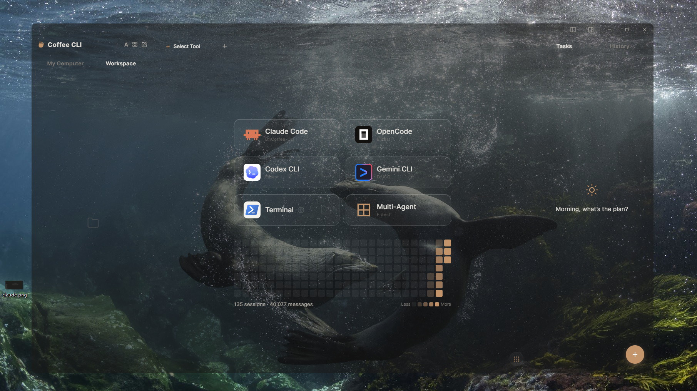
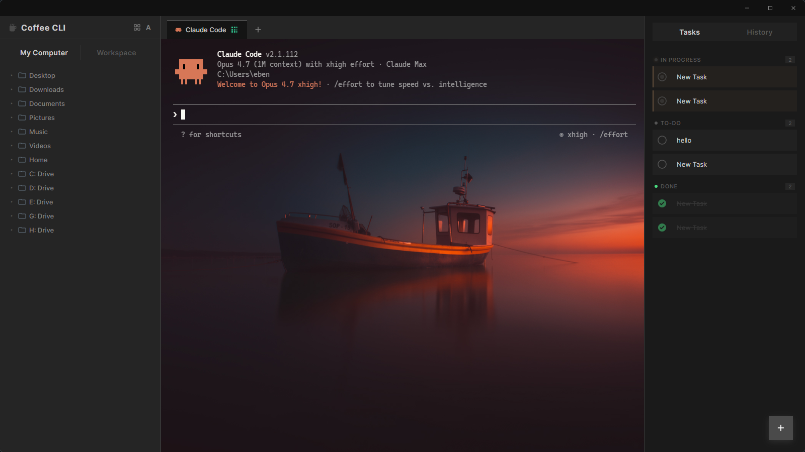
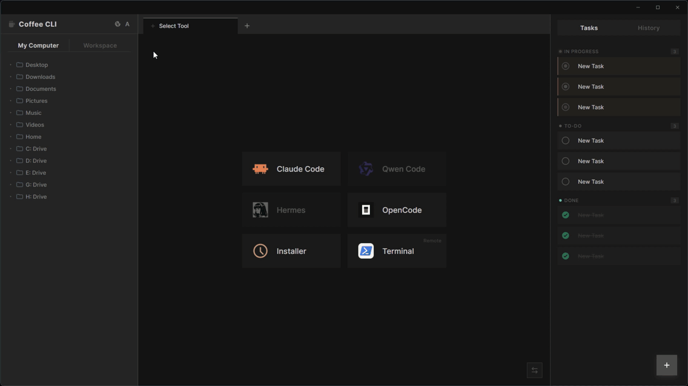
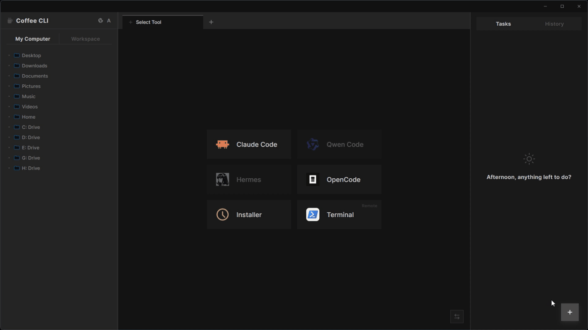
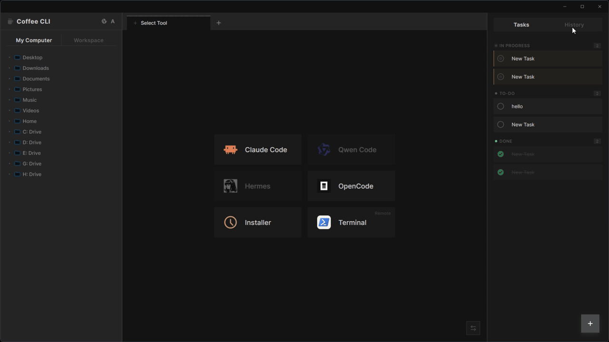
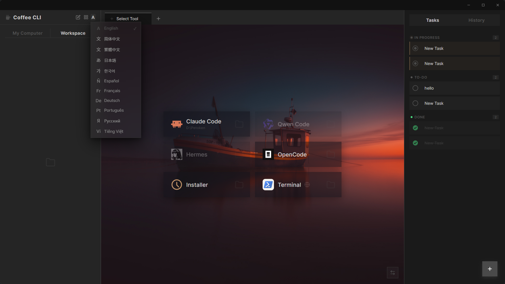

<p align="center">
  
</p>

<h1 align="center">Coffee CLI</h1>

<p align="center">
  <strong>Do you like this kind of Claude Code?</strong>
</p>

<p align="center">
  <a href="#english">English</a> ·
  <a href="#简体中文">简体中文</a> ·
  <a href="#繁體中文">繁體中文</a> ·
  <a href="#deutsch">Deutsch</a> ·
  <a href="#español">Español</a> ·
  <a href="#français">Français</a> ·
  <a href="#日本語">日本語</a> ·
  <a href="#한국어">한국어</a> ·
  <a href="#português">Português</a> ·
  <a href="#русский">Русский</a>
</p>

<p align="center">
  
  
  
  
</p>

<p align="center">
  
</p>

---

## English

### What is Coffee CLI?

Coffee CLI is a **native desktop workspace** for AI CLI agents — Claude Code, OpenAI Codex, Qwen, OpenCode, and more. Run multiple agents in parallel tabs, drive them with keyboard shortcuts via Gambit, automate them with hooks, and keep everything organized in one true desktop app — all with a **fully localized interface in 11 languages**.

This is not a web app. Not an Electron wrapper. A **true native desktop app** built with Tauri (Rust core), engineered for performance and low resource usage.

<p align="center">
  
</p>

### Who is it for?

AI coding agents are transforming how work gets done — but they speak English, output dense terminal text, and assume you're comfortable with a command line. That leaves out a massive group of capable, intelligent professionals:

- **Business executives** who want AI to accelerate decisions and automate operations
- **Designers and creatives** who want to build and automate without learning bash
- **Product managers** who want to run agents against their own products
- **Researchers, analysts, consultants** — any domain expert who isn't a developer

Coffee CLI removes both barriers at once: **no terminal expertise required, no English required**.

---

### See It In Action

#### Theme Switching

Coffee CLI ships with multiple built-in themes. Switch between them instantly — the entire interface, including the active terminal session, updates live. No restart, no flicker. Whether you prefer a dark workspace late at night or a lighter tone during a presentation, one click is all it takes.



---

#### Task Board

Your agent works fast. Keep up with it. The built-in task board lets you create and organize tasks into **To-Do / In Progress / Done** columns — right in the sidebar while the agent runs. No external tool, no tab switching. Everything the agent is doing and everything you still need it to do, visible at a glance.



---

#### Session History

Every conversation with every agent is automatically saved. The **History panel** gives you a full searchable log of past sessions — scroll back through what was said, what was built, what went wrong. Pick up any past session exactly where you left off, or use it as context for a new one.



---

#### Multi-Tab: Vibe Coding + DOS Game

Run multiple agents and terminals in parallel, each in its own tab with its own independent context. Here: a **Claude Code vibe-coding session** running alongside a **DOS game in the built-in terminal** — two completely separate processes, zero interference. Coffee CLI handles whatever you throw at it.


---

#### 11-Language Interface

The Coffee CLI app ships with a fully localized UI in 11 languages — menus, dialogs, shortcuts, and every corner of the workspace speak English, 简体中文, 繁體中文, 日本語, 한국어, Español, Français, Deutsch, Português, Русский, or Tiếng Việt. Switch anytime from the settings.



---

### Key Features

| Feature | Description |
|---|---|
| **Multi-Tab Sessions** | Run multiple agents side by side, each with its own independent process and context |
| **Session History** | Every session auto-saved and searchable; resume any conversation from where you left off |
| **Built-In File Explorer** | Browse your workspace, copy paths, drag references directly into your prompt |
| **Task Board** | Organize what you've asked the agent to do across To-Do / In Progress / Done |
| **Agent Installer** | One-click install of Claude Code, Codex, and more — no terminal required |
| **Remote Terminal** | SSH into remote machines and run agents on servers without leaving the app |

**11 languages supported out of the box:** English · 简体中文 · 繁體中文 · Deutsch · Español · Français · 日本語 · 한국어 · Português · Русский · Tiếng Việt

---

### Install

**Windows**
```powershell
irm https://raw.githubusercontent.com/edison7009/Coffee-CLI/main/install/install.ps1 | iex
```

**macOS** (Apple Silicon & Intel)
```bash
curl -fsSL https://raw.githubusercontent.com/edison7009/Coffee-CLI/main/install/install.sh | sh
```

**Linux** (Debian / Ubuntu / AppImage)
```bash
curl -fsSL https://raw.githubusercontent.com/edison7009/Coffee-CLI/main/install/install.sh | sh
```

Or download directly from [Releases](https://github.com/edison7009/Coffee-CLI/releases).

| Platform | Installer |
|---|---|
| Windows x64 | `.exe` setup |
| macOS Apple Silicon (M1+) | `.dmg` |
| Linux Debian/Ubuntu | `.deb` |
| Linux universal | `.AppImage` |

### Build from Source

```bash
# Prerequisites: Rust, Node.js
git clone https://github.com/edison7009/Coffee-CLI
cd Coffee-CLI
cd src-ui && npm install && cd ..
cargo tauri build
```

---

## 简体中文

### Coffee CLI 是什么？

Coffee CLI 是专为 AI CLI Agent 打造的**原生桌面工作台**，支持 Claude Code、OpenAI Codex、Qwen、OpenCode 等主流 Agent。多 Tab 并行运行、Gambit 快捷操控、Hook 自动化——所有 AI CLI 工具在一个真正的桌面应用里井然有序，**原生支持 11 种界面语言**。

这不是网页应用，不是 Electron 壳，而是基于 Tauri（Rust 内核）构建的**真正原生桌面应用**，性能优异，资源占用极低。

### 为谁而生？

AI 编程 Agent 正在改变工作方式——但它们说英语、输出密集的终端文本，默认你熟悉命令行。这将大量有能力、有智识的专业人士拒之门外：

- **企业高管**：想用 AI 加速决策、自动化业务流程
- **设计师与创意人**：想构建和自动化，但不想学 bash
- **产品经理**：想直接对自己的产品跑 Agent
- **研究员、分析师、顾问**：各行各业的领域专家，不是开发者

Coffee CLI 同时消除两道门槛：**不需要终端经验，不需要懂英语**。

### 核心功能

**多 Tab 会话** · **Gambit 快捷命令** · **Hook 自动化** · **会话历史** · **内置文件浏览器** · **任务板** · **Agent 安装器** · **远程终端**

原生支持 11 种语言，开箱即用。

### 安装

**Windows**
```powershell
irm https://raw.githubusercontent.com/edison7009/Coffee-CLI/main/install/install.ps1 | iex
```

**macOS / Linux**
```bash
curl -fsSL https://raw.githubusercontent.com/edison7009/Coffee-CLI/main/install/install.sh | sh
```

也可以直接从 [Releases](https://github.com/edison7009/Coffee-CLI/releases) 下载对应平台的安装包。

---

## 繁體中文

### Coffee CLI 是什麼？

Coffee CLI 是專為 AI CLI Agent 打造的**原生桌面伴侶應用**，支援 Claude Code、OpenAI Codex 等主流 Agent。它將終端包裝進完整的圖形介面，並實現了其他任何工具都沒有的功能：**將整個 CLI Agent 介面即時翻譯成你的母語**。

這不是網頁應用，不是 Electron 殼，而是基於 Tauri（Rust 核心）構建的**真正原生桌面應用**，效能優異，資源佔用極低。

Coffee CLI 同時消除兩道門檻：**不需要終端經驗，不需要懂英語**。

**核心功能：** 即時終端翻譯 · 多 Tab 會話 · 會話歷史 · 內建檔案瀏覽器 · 任務板 · Agent 安裝器 · 遠端終端

原生支援 11 種語言，開箱即用。

---

## Deutsch

### Was ist Coffee CLI?

Coffee CLI ist eine **native Desktop-Begleit-App** für KI-CLI-Agenten — Claude Code, OpenAI Codex und mehr. Es bettet Ihr Terminal in eine vollständige GUI ein und tut etwas, das kein anderes Tool leistet: Es **übersetzt die gesamte CLI-Agent-Oberfläche in Ihre Muttersprache, in Echtzeit**.

Keine Web-App. Kein Electron-Wrapper. Eine **echte native Desktop-Anwendung**, gebaut mit Tauri (Rust-Kern).

Coffee CLI beseitigt beide Hürden gleichzeitig: **Keine Terminal-Kenntnisse erforderlich, kein Englisch erforderlich.**

**Hauptfunktionen:** Echtzeit-Terminal-Übersetzung · Multi-Tab-Sitzungen · Sitzungsverlauf · Datei-Explorer · Aufgaben-Board · Agent-Installer · Remote-Terminal

11 Sprachen werden nativ unterstützt.

---

## Español

### ¿Qué es Coffee CLI?

Coffee CLI es una **aplicación de escritorio nativa** diseñada para agentes de IA en CLI — Claude Code, OpenAI Codex y más. Envuelve tu terminal en una interfaz gráfica completa y hace algo que ninguna otra herramienta hace: **traduce toda la interfaz del agente CLI a tu idioma nativo, en tiempo real**.

No es una aplicación web. No es un envoltorio de Electron. Es una **aplicación de escritorio nativa real**, construida con Tauri (núcleo en Rust).

Coffee CLI elimina ambas barreras a la vez: **sin necesidad de experiencia en terminal, sin necesidad de saber inglés.**

**Funciones principales:** Traducción de terminal en tiempo real · Sesiones multi-pestaña · Historial de sesiones · Explorador de archivos · Tablero de tareas · Instalador de agentes · Terminal remota

10 idiomas compatibles de serie.

---

## Français

### Qu'est-ce que Coffee CLI ?

Coffee CLI est une **application de bureau native** conçue pour les agents IA en ligne de commande — Claude Code, OpenAI Codex et autres. Elle enveloppe votre terminal dans une interface graphique complète et fait quelque chose qu'aucun autre outil ne fait : **elle traduit toute l'interface de l'agent CLI dans votre langue maternelle, en temps réel**.

Ce n'est pas une application web. Pas un wrapper Electron. Une **vraie application de bureau native**, construite avec Tauri (cœur Rust).

Coffee CLI supprime les deux barrières à la fois : **aucune expertise terminal requise, aucune connaissance de l'anglais requise.**

**Fonctionnalités clés :** Traduction de terminal en temps réel · Sessions multi-onglets · Historique des sessions · Explorateur de fichiers · Tableau de tâches · Installeur d'agents · Terminal distant

10 langues prises en charge nativement.

---

## 日本語

### Coffee CLI とは？

Coffee CLI は、AI CLI エージェント（Claude Code、OpenAI Codex など）向けに作られた**ネイティブデスクトップコンパニオンアプリ**です。ターミナルを完全な GUI でラップし、他のどのツールも実現していない機能を提供します：**CLI エージェントのインターフェース全体をリアルタイムであなたの母国語に翻訳する**機能です。

ウェブアプリでも Electron ラッパーでもありません。Tauri（Rust コア）で構築された**真のネイティブデスクトップアプリ**です。

Coffee CLI はその2つのハードルを同時に取り除きます：**ターミナルの知識不要、英語不要**。

**主な機能：** リアルタイム翻訳 · マルチタブセッション · セッション履歴 · ファイルエクスプローラー · タスクボード · エージェントインストーラー · リモートターミナル

11言語をネイティブサポート。

---

## 한국어

### Coffee CLI란?

Coffee CLI는 AI CLI 에이전트(Claude Code, OpenAI Codex 등)를 위한 **네이티브 데스크톱 컴패니언 앱**입니다. 터미널을 완전한 GUI로 감싸고, 다른 어떤 도구도 하지 못하는 기능을 제공합니다: **CLI 에이전트 인터페이스 전체를 실시간으로 모국어로 번역**합니다.

웹 앱도 아니고 Electron 래퍼도 아닙니다. Tauri(Rust 코어)로 구축된 **진정한 네이티브 데스크톱 앱**입니다.

Coffee CLI는 두 가지 장벽을 동시에 제거합니다: **터미널 지식 불필요, 영어 불필요**.

**주요 기능:** 실시간 번역 · 멀티탭 세션 · 세션 히스토리 · 파일 탐색기 · 작업 보드 · 에이전트 설치 관리자 · 원격 터미널

11개 언어 기본 지원.

---

## Português

### O que é o Coffee CLI?

Coffee CLI é um **aplicativo de desktop nativo** projetado para agentes de IA em CLI — Claude Code, OpenAI Codex e outros. Ele envolve seu terminal em uma interface gráfica completa e faz algo que nenhuma outra ferramenta faz: **traduz toda a interface do agente CLI para seu idioma nativo, em tempo real**.

Não é um aplicativo web. Não é um wrapper Electron. É um **verdadeiro aplicativo de desktop nativo**, construído com Tauri (núcleo em Rust).

Coffee CLI elimina as duas barreiras ao mesmo tempo: **sem necessidade de experiência em terminal, sem necessidade de saber inglês.**

**Recursos principais:** Tradução de terminal em tempo real · Sessões multi-aba · Histórico de sessões · Explorador de arquivos · Quadro de tarefas · Instalador de agentes · Terminal remoto

10 idiomas suportados nativamente.

---

## Русский

### Что такое Coffee CLI?

Coffee CLI — это **нативное десктопное приложение-компаньон** для ИИ-агентов в CLI — Claude Code, OpenAI Codex и других. Оно оборачивает терминал в полноценный графический интерфейс и делает то, чего не умеет ни один другой инструмент: **переводит весь интерфейс CLI-агента на ваш родной язык в реальном времени**.

Это не веб-приложение. Не обёртка на Electron. Настоящее **нативное десктопное приложение**, построенное на Tauri (ядро на Rust).

Coffee CLI устраняет оба барьера одновременно: **не нужно знать терминал, не нужно знать английский**.

**Ключевые функции:** Перевод терминала в реальном времени · Мультивкладочные сессии · История сессий · Файловый проводник · Доска задач · Установщик агентов · Удалённый терминал

11 языков поддерживается нативно.

---

## License & Trademarks

**Code** — Coffee CLI is licensed under the
[GNU Affero General Public License v3.0 or later (AGPL-3.0-or-later)](LICENSE).
Any fork, modification, or hosted service derived from this code must also be
released under AGPL-3.0 — including SaaS deployments. See [LICENSE](LICENSE)
for the full text and [NOTICE](NOTICE) for attribution requirements.

**Brand** — *Coffee CLI*, *Gambit*, *Pitch*, *VibeID*, *Vibetype* (and
the 16 individual Vibetype names), *Coffee-CLI MCP*, *Sentinel Protocol*,
and *Hyper-Agent* are common-law trademarks of edison7009. **Forks are
welcome — no need to scrub our name and logo.** If your fork honestly
credits Coffee CLI as upstream (README, About screen, or product page),
you may keep our identity visible (e.g. "Coffee CLI Community Edition
by X"). If you prefer to rebrand entirely, that's also fine — just keep
the NOTICE attribution. The hard line is **commercial SaaS / app-store
products literally branded with our marks** without permission, or
**presenting the code as your own from-scratch original work**.
Genuinely original code you add on top of either path belongs to you,
named however you like. The app icon is from the
[line-md](https://github.com/cyberalien/line-md) icon set (Apache-2.0,
by Vjacheslav Trushkin) and is **not** claimed as a mark. Reviews,
tutorials, and honest references — including critical ones — are
welcome without permission. See [TRADEMARKS.md](TRADEMARKS.md) for the
full policy.

**Contributing** — See [CONTRIBUTING.md](CONTRIBUTING.md). All contributions
are accepted under the project's CLA so that future relicensing remains possible.

---

## 协议与商标

**代码** — Coffee CLI 采用
[GNU Affero 通用公共许可证 v3 或更高版本 (AGPL-3.0-or-later)](LICENSE) 发布。
任何 fork、修改版本或基于本代码部署的托管服务,都必须同样以 AGPL-3.0 开源 ——
**SaaS 部署也不例外**。完整文本见 [LICENSE](LICENSE),署名要求见 [NOTICE](NOTICE)。

**品牌** — *Coffee CLI*、*Gambit*、*Pitch / 投递*、*VibeID*、
*Vibetype / Vibe 型*(及 16 个具体 Vibetype 名称)、*Coffee-CLI MCP*、
*哨兵协议 / Sentinel Protocol*、*Hyper-Agent* 为 edison7009 的普通法
商标。**Fork 欢迎 —— 无需抹掉我们的名字和 Logo**。如果你的 fork 在
README / About 页面 / 产品页诚实标注 Coffee CLI 为上游,可以保留我们
的身份可见(例:"Coffee CLI 社区版 by X");如果你坚持完全重新品牌化
也可以,改名 + 替换 Logo,但 NOTICE 中保留致谢。硬底线只有两条:
**未授权的商业 SaaS / 应用商店产品字面挂我们的商标**;以及**把代码
当作你从零写的原创发布**。Fork 之上你新增的原创代码归你,你想怎么
命名都行。应用图标取自 [line-md 图标集](https://github.com/cyberalien/line-md)
(Apache-2.0,作者 Vjacheslav Trushkin),**不**主张为本项目商标。
评测、教程、事实性引用 —— **包括批评** —— 都欢迎,无需授权。完整政策见
[TRADEMARKS.md](TRADEMARKS.md)。

**贡献** — 见 [CONTRIBUTING.md](CONTRIBUTING.md)。所有贡献按项目 CLA 接收,
以保持未来重新授权的灵活性。

---

Copyright © 2024-2026 [edison7009](https://github.com/edison7009) and Coffee CLI contributors.
